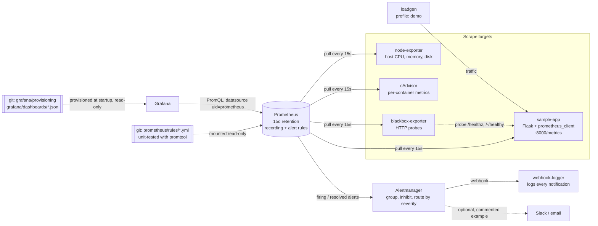

# Observability Stack

[](https://github.com/frenzyali/observability-stack/actions/workflows/ci.yml)

A monitoring and alerting stack run with Docker Compose (Prometheus, Alertmanager, Grafana, exporters and an instrumented sample app). Dashboards and alerts are defined as code, the alert rules are unit-tested, and CI breaks the app on purpose and proves the alerts reach a receiver.

## Architecture



Three flows: **scrape** (Prometheus pulls metrics from every target), **alert** (rules fire → Alertmanager groups, inhibits and routes them → a receiver), and **provisioning** (Grafana loads its datasource and dashboards from files in git; nothing is configured by clicking).

## Stack

Image versions are pinned to exact tags. They were looked up with `gh api repos/<org>/<repo>/releases/latest` on **2026-10-06**.

| Component | Image | Role |
|---|---|---|
| Prometheus | `prom/prometheus:v3.15.0` | Scraping, storage (15 days), recording and alerting rules |
| Alertmanager | `prom/alertmanager:v0.34.1` | Grouping, inhibition, severity routing, notifications |
| Grafana | `grafana/grafana:13.2.3` | Dashboards, provisioned from files |
| node-exporter | `prom/node-exporter:v1.12.1` | Host CPU, memory, filesystem, disk I/O |
| cAdvisor | `ghcr.io/google/cadvisor:v0.60.6` | Per-container CPU, memory, block I/O, restarts |
| blackbox-exporter | `prom/blackbox-exporter:v0.28.0` | HTTP uptime probes |
| sample-app / loadgen | built from `python:3.14.8-slim-trixie` | Flask 3.1, gunicorn, prometheus_client 0.26 |
| webhook-logger | `python:3.14.8-slim-trixie` (standard library only) | Local alert receiver for tests |
| CI | GitHub Actions | lint + unit tests + Trivy, then an end-to-end alert test |

## What it demonstrates

- **Everything as code.** Scrape config, recording and alert rules, Alertmanager routing, the Grafana datasource and five dashboards all live in git and load at startup. The dashboards are generated by `grafana/generate.py`, and CI fails if the committed JSON drifts from the generator.
- **Alerts with unit tests.** `promtool test rules` covers all 12 alerts with firing and non-firing cases, including edge cases: tmpfs ignored, low-traffic guard, unlimited containers excluded, and the burn-rate alert resetting once errors stop. A lint step fails if any alert lacks either case.
- **SLO-based alerting.** A 99.5% availability SLO with multi-window, multi-burn-rate alerts (Google SRE Workbook pattern), backed by recording rules and shown on error-budget panels.
- **A real end-to-end alert test.** `scripts/smoke-test.sh` breaks the app (errors, then a stopped container) and asserts that `HighErrorRate` and `InstanceDown` reach `firing` in Alertmanager, that the receiver logged the notifications, that inhibition works, and that everything resolves afterwards. It runs on every push.
- **Production habits at small scale.** Healthchecks with `depends_on: service_healthy`, pinned versions, resource limits, read-only root filesystems, all capabilities dropped, ports bound to `127.0.0.1`, secrets only in a gitignored `.env`.
- **Dashboard queries are tested.** Every panel's PromQL is extracted with `jq` and run against the live Prometheus API, so a typo in a dashboard fails CI.

## Prerequisites

- Docker Engine 24+ with the Compose v2 plugin (`docker compose`)
- `make`, `curl`, `jq`, `python3` (for the test scripts and the dashboard generator)
- Linux host (node-exporter and cAdvisor read host `/proc`, `/sys` and cgroups; see [Security notes](#security-notes))
- Free local ports 3000, 9090, 9093, 8000 (change them in `.env` if needed)

## Quick start

```bash
git clone https://github.com/frenzyali/observability-stack.git
cd observability-stack
cp .env.example .env      # then set GRAFANA_ADMIN_PASSWORD to something of your own
make up                   # builds the sample app, starts everything, waits until healthy
make demo                 # optional: adds the load generator so dashboards have traffic
```

| Service | URL | Login |
|---|---|---|
| Grafana | http://127.0.0.1:3000 | `GRAFANA_ADMIN_USER` / `GRAFANA_ADMIN_PASSWORD` from `.env` |
| Prometheus | http://127.0.0.1:9090 | none (loopback only) |
| Alertmanager | http://127.0.0.1:9093 | none (loopback only) |
| Sample app | http://127.0.0.1:8000 (`/`, `/slow`, `/error`, `/healthz`, `/metrics`) | none |

Grafana opens on the *Sample app: RED and SLO* dashboard. All dashboards are in the *Observability Stack* folder. Anonymous access and sign-up are disabled.

If a port is already taken, change `GRAFANA_PORT`, `PROMETHEUS_PORT`, `ALERTMANAGER_PORT` or `SAMPLE_APP_PORT` in `.env`.

## See it work

With the stack running (`make demo`), in one terminal:

```bash
make logs                 # follows webhook-logger: every notification Alertmanager sends lands here
```

In another:

```bash
make chaos                # scripts/chaos.sh demo
```

`chaos.sh demo` injects 80% errors into the sample app, waits 3 minutes, clears the errors and stops the container, waits 2 minutes, then starts it again. You will see:

1. `HighErrorRate` (and the SLO burn-rate alerts) go pending → firing on http://127.0.0.1:9090/alerts, then appear in Alertmanager at http://127.0.0.1:9093.
2. A line like `ALERT {"alertname": "HighErrorRate", "receiver": "critical", "severity": "critical", "status": "firing", ...}` in the webhook log.
3. `InstanceDown` once the container stops. Alertmanager marks the app's other alerts as *suppressed* (inhibited), so you are told about the cause once rather than about every symptom.
4. `"status": "resolved"` notifications after recovery. The error-rate alert takes a few minutes, because the failed requests have to leave the 5-minute rate window.

The individual steps are available too: `scripts/chaos.sh errors|latency|down|up|clear|recover`.

## Project layout

```text
.
├── compose.yaml                  # the stack (project name obs-stack)
├── compose.test.yaml             # smoke-test override: fast timings, same rules
├── .env.example                  # placeholder credentials and ports (copy to .env)
├── Makefile
├── prometheus/
│   ├── prometheus.yml            # scrape config, relabeling, cardinality controls
│   ├── rules/                    # recording.yml, slo-recording.yml, host.yml, container.yml, app.yml, slo.yml
│   └── tests/                    # promtool unit tests, one file per rule area
├── alertmanager/alertmanager.yml # routing, grouping, inhibition, receivers
├── blackbox/blackbox.yml         # probe modules
├── grafana/
│   ├── generate.py               # dashboards as code -> dashboards/*.json
│   ├── dashboards/               # 5 generated dashboards (committed, provisioned)
│   └── provisioning/             # datasource (uid=prometheus) and dashboard provider
├── app/                          # sample Flask app, load generator, Dockerfile
├── webhook-logger/server.py      # local alert receiver
├── scripts/
│   ├── lint.sh                   # all static checks in pinned tool containers
│   ├── smoke-test.sh             # end-to-end test
│   ├── chaos.sh                  # fault injection
│   ├── check-dashboard-queries.sh
│   └── render-test-config.sh
├── docs/runbooks.md              # one runbook per alert
└── .github/workflows/ci.yml
```

## Alert catalogue

| Alert | Condition (summary) | Severity | Why it matters |
|---|---|---|---|
| InstanceDown | `up == 0` for 1m | critical | Nothing else about a target can be trusted if it can't be scraped; inhibits that target's other alerts |
| HostHighCPU | CPU busy > 90% for 10m | warning | Sustained saturation slows everything on the host |
| HostHighMemory | `1 - MemAvailable/MemTotal` > 90% for 10m | warning | The OOM killer is close |
| HostDiskSpaceLow | < 10% free on a real filesystem for 5m | critical | Full disks break databases, logs and Docker |
| HostDiskWillFillIn24h | `predict_linear` over 6h reaches 0 within 24h and < 40% free, for 1h | warning | A day's notice before the disk fills |
| ContainerRestarting | > 2 starts in 15m | warning | A crash loop hides behind restart policies |
| ContainerHighMemory | working set > 90% of the memory limit for 5m | warning | An OOM kill is about to happen |
| ProbeFailed | blackbox HTTP probe not 2xx for 2m | critical | What a user would actually see |
| HighErrorRate | 5xx ratio > 5% over 5m (with ≥ 0.1 req/s) for 2m | critical | Users are getting errors |
| HighLatencyP95 | p95 latency > 1s for 5m (with traffic) | warning | Users are waiting |
| SLOErrorBudgetBurnFast | burn rate > 14.4× (1h and 5m) or > 6× (6h and 30m) | critical | The 7-day error budget will be gone within about a day |
| SLOErrorBudgetBurnSlow | burn rate > 3× (1d and 2h) or > 1× (3d and 6h) | warning | The budget will run out before the window ends |

Every alert has `summary`, `description` and a `runbook_url` that points to its section in [docs/runbooks.md](docs/runbooks.md).

Alertmanager routing: `critical` → `webhook-critical` (repeat every 1h), `warning` → `webhook-warning` (repeat every 12h), grouped by `alertname, job, instance`. Inhibition: `InstanceDown` mutes every other alert for the same `instance`; a `critical` alert mutes the `warning` alert of the same name and instance; fast burn mutes slow burn.

## SLO and burn rate, in plain language

The sample app promises that **99.5% of requests succeed** (do not return a 5xx), measured over a rolling **7 days**. The other 0.5% is the **error budget**: the failures you are allowed before breaking the promise.

**Burn rate** is how fast you spend that budget. At burn rate 1 you spend exactly the whole budget in 7 days. At burn rate 14.4 you would spend it in about 12 hours.

A plain "error rate > X%" alert is either too noisy (it pages on a 30-second blip) or too slow (it misses a small leak that lasts all week). Burn-rate alerts fix this by asking two questions at once:

- **A long window** (e.g. 1 hour): has this been going on long enough to matter?
- **A short window** (e.g. 5 minutes): is it still happening now?

Both must be true. The long window filters out blips. The short window makes the alert stop as soon as the problem is fixed, instead of firing for another hour while the long window catches up (a unit test checks this). Fast burns page someone (`critical`); slow burns open a ticket (`warning`). The thresholds follow chapter 5 of the Google SRE Workbook.

The *Sample app: RED and SLO* dashboard shows availability, the remaining error budget, and the burn rate in each window.

## Design decisions

1. **Pull, not push.** Prometheus scrapes its targets, so a missing target is itself a signal (`up == 0` → `InstanceDown`), and targets don't need to know where monitoring lives. *Trade-off:* short-lived batch jobs would need a Pushgateway, and Prometheus must be able to reach every target over the network.
2. **Recording rules for the expensive queries.** Error ratios, p95 latency and the SLO ratios for 8 windows (up to 7 days) are precomputed once per evaluation. Alerts and dashboards then read a cheap series instead of re-running `rate()` over days of raw data on every refresh. *Trade-off:* more rules to maintain, and a recorded series only has history from when the rule was added.
3. **Page on symptoms, ticket on causes.** Pages (`critical`) are for things users feel: errors, SLO burn, failed probes, a target down. Causes like high CPU or memory are `warning`s, because a busy host that still serves users well is not an emergency. *Trade-off:* a cause can quietly turn into a symptom. The disk alerts are the exception, because a full disk fails hard.
4. **Burn-rate alerts alongside a threshold alert.** The SLO alerts measure impact on the error budget. `HighErrorRate` (5%) stays as a simpler, faster signal that is easy to explain and to test end to end. *Trade-off:* overlapping alerts. Inhibition and grouping keep the noise down.
5. **Cardinality control.** The app labels requests by route template (`/slow`), never the raw URL, so a scan of random paths cannot create unbounded series. cAdvisor is limited to Docker container cgroups (not every systemd unit), and unused metric families are dropped at scrape time. The self-health dashboard tracks the head-series count. *Trade-off:* less detail (no per-URL or per-systemd-unit breakdowns).
6. **15-day retention, no remote storage.** That is enough for the 7-day SLO window and its 3-day burn-rate window, and keeps disk use predictable on one machine. *Trade-off:* no long-term trends or capacity planning beyond two weeks (see Roadmap: remote-write / Thanos).
7. **No privileged containers and no Docker socket.** node-exporter and cAdvisor get read-only host mounts and nothing else. cAdvisor gets one extra capability (`DAC_READ_SEARCH`, read-only file access); everything else drops all capabilities. Mounting `/var/run/docker.sock` would have given cAdvisor container names, but it also hands full control of the Docker daemon (effectively root on the host) to a metrics exporter. *Trade-off:* containers show up by short ID instead of name, and per-container network metrics are not available (they need the Docker API).
8. **A local webhook receiver instead of Slack.** Tests need a receiver that is deterministic, needs no credentials, and can be inspected. *Trade-off:* nobody actually gets paged until you enable a real receiver (example in `alertmanager/alertmanager.yml`).
9. **Shorter timings only for the smoke test.** `compose.test.yaml` mounts a copy of the config with 5s intervals and 15s `for:` durations. The expressions, thresholds and routes are unchanged, and `render-test-config.sh` fails if a substitution stops matching. *Trade-off:* the end-to-end test does not exercise the production `for:` durations. The promtool unit tests do.

## Security notes

- **Ports:** every published port binds to `127.0.0.1`, and a lint check fails if one does not. Prometheus and Alertmanager have no authentication of their own, so they must not be exposed beyond the host without a reverse proxy that handles auth and TLS.
- **Grafana:** admin password from `.env` (gitignored; `.env.example` has placeholder values only). Anonymous access, sign-up and org creation are disabled; telemetry, update checks and plugin preinstall are off.
- **Containers:** `no-new-privileges`, `cap_drop: ALL`, read-only root filesystems (writable named volumes or tmpfs only where needed), resource limits, non-root users for the sample app, webhook-logger, blackbox-exporter, Prometheus and Alertmanager.
- **Host mounts (read-only), and why:**
  - node-exporter: `/` → `/host`, plus `/proc` and `/sys`. Host CPU, memory and filesystem metrics come from the host's `/proc` and `/sys`, not the container's. It uses neither the host PID nor the host network namespace.
  - cAdvisor: `/`, `/sys`, `/var/lib/docker`, `/dev/disk`. It reads per-container resource usage from the cgroup filesystem and container state from Docker's data directory. It cannot change anything there.
- **Fault injection:** `/chaos` on the sample app is a deliberate demo feature, reachable only on loopback. Set `SAMPLE_APP_CHAOS_ENABLED=false` to turn it into a 404.
- **Real receivers:** the Slack and email examples read secrets from files (`api_url_file`, `auth_password_file`) mounted at runtime. `alertmanager/secrets/` is gitignored.
- **Supply chain:** every image is pinned to an exact version; GitHub Actions are pinned to full release tags; Python dependencies are pinned in `requirements.txt`. Trivy scans the sample-app image in CI. gitleaks scans the full git history.

**Accepted risk (Trivy, 2026-10-06):** the sample-app image has 0 CRITICAL and 44 HIGH findings, all in Debian 13 base packages (util-linux, acl and similar) that have no fixed version available yet. The app does not call these tools, and it runs as a non-root user with no capabilities and `no-new-privileges`, which limits what any of them could be used for. CI fails on any CRITICAL finding that has a fix. The report is uploaded as a CI artifact.

## Testing

| Check | Command | What it proves |
|---|---|---|
| Compose config | `docker compose config -q` (base + test override) | The compose files are valid; every published port is loopback-only |
| promtool check config / rules | `promtool check config`, `check rules` | Prometheus config and all rule files parse, and the PromQL in them is valid |
| promtool unit tests | `promtool test rules prometheus/tests/*.yml` | Each alert fires on the right input and stays quiet on the wrong input (12 alerts, firing and non-firing) |
| Alert coverage | `scripts/lint.sh alert_coverage` | No alert can be added without both kinds of test |
| amtool | `amtool check-config` | Alertmanager routing and inhibition config is valid |
| yamllint | `yamllint --strict .` | Consistent, valid YAML everywhere |
| Dashboards | `jq empty`, datasource UID check, `generate.py --check` | Dashboards are valid JSON, use the provisioned datasource, and match their source |
| hadolint | `hadolint app/Dockerfile` | Dockerfile best practices |
| shellcheck | `shellcheck scripts/*.sh` | Scripts are free of common shell bugs |
| gitleaks | `gitleaks git` (full history) | No secrets were ever committed |
| Trivy | image scan from a `docker save` tarball | No fixable CRITICAL vulnerabilities in the app image |
| Dashboard queries | `scripts/check-dashboard-queries.sh` | Every panel and variable query runs without error on a live Prometheus |
| End-to-end | `scripts/smoke-test.sh` | All services healthy, all targets up, Grafana provisioned and locked down, alerts fire, are routed, inhibited, delivered and resolved |

Run them with `make lint` (all static checks), `make test` (rule unit tests and the dashboard drift check) and `make smoke` (end to end, about 10 minutes). Every static check runs in a pinned throwaway container, so only Docker, `jq` and `python3` need to be installed locally.

`make smoke` uses the Compose project `obs-stack`, so it **replaces a stack you started with `make up`: it removes its containers and volumes before starting (a clean baseline) and again at the end**. Use `KEEP_UP=1 scripts/smoke-test.sh` to leave it running.

## Known limitations

- **Single node, no HA.** One Prometheus and one Alertmanager. If the host dies, monitoring dies with it, and nothing alerts on that. A real setup needs an external dead-man's switch (an always-firing "Watchdog" alert sent to an outside service) and Alertmanager clustering.
- **No long-term storage.** 15 days of local TSDB only; no Thanos, Mimir or remote-write.
- **No logs or traces.** Metrics only. When an alert fires you read `docker compose logs` by hand.
- **Local-only receivers.** Alerts go to `webhook-logger`. Slack and email are documented examples, not tested integrations.
- **Containers by ID, not name.** This follows from not mounting the Docker socket (see Design decisions). Per-container network metrics are missing for the same reason.
- **Host metrics inside a container.** node-exporter does not use the host network namespace, so host network-interface metrics are not collected.
- **Linux only.** On Docker Desktop (macOS and Windows), node-exporter and cAdvisor see the Docker VM, not your machine.
- **Screenshots are not included.** Grafana's image renderer would add a headless Chromium plugin to the stack, which I left out to keep it small. Run `make demo` to see the dashboards live.

## Roadmap

- **Logs:** Loki, with Grafana Alloy collecting container logs, linked from alert annotations.
- **Grafana Alloy** as a single agent replacing node-exporter and cAdvisor scraping on remote hosts.
- **Remote-write** to long-term storage (Thanos or Mimir) for retention beyond 15 days.
- **Kubernetes:** move the same rules and dashboards to the kube-prometheus-stack Helm chart, with rules as `PrometheusRule` resources.
- **Watchdog / dead-man's switch** to an external heartbeat service.

## Cleanup

```bash
make clean                # = docker compose -p obs-stack --profile demo down -v --remove-orphans
docker image rm obs-stack/sample-app:local   # optional: the locally built sample-app image
rm -f .env
```

Only resources of the `obs-stack` Compose project are removed. Check with:

```bash
docker ps -a --filter label=com.docker.compose.project=obs-stack
docker volume ls --filter label=com.docker.compose.project=obs-stack
docker network ls --filter label=com.docker.compose.project=obs-stack
```

## Related work

- [reddit-clone-k8s](https://github.com/frenzyali/reddit-clone-k8s): a Next.js app on Kubernetes with health probes, resource limits and manifest validation in CI.
- [3-Tier-Laravel-Application-Deployment](https://github.com/frenzyali/3-Tier-Laravel-Application-Deployment): three Laravel apps behind Nginx with MySQL on Docker Compose, with healthcheck-ordered startup.

## License

[MIT](LICENSE) © 2026 Syed Ali Hussain
